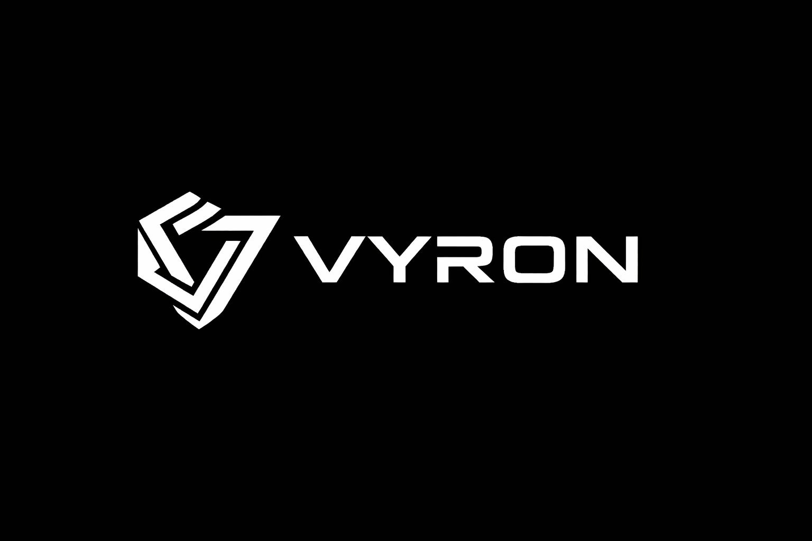

  
  <h1>Vyron</h1>
  
<strong>Context Engineering para gerar sites com identidade real de cada empresa.</strong>

  

    De dados brutos para presença digital consistente:
    contexto estruturado, copy coerente e layout alinhado à marca.
  

## Conceito do Projeto
O **Vyron** nasceu para resolver um problema comum em geração de sites com IA: resultados genéricos por falta de contexto confiável.

Em vez de depender de prompts soltos, o projeto organiza dados reais da empresa (conteúdo, referência visual e posicionamento) em um fluxo estruturado para orientar a criação de páginas com mais consistência.

## Problema que o Vyron ataca
- Sites gerados sem identidade da marca
- Falta de coerência entre conteúdo, visual e proposta de valor
- Retrabalho manual para corrigir texto, tom e estrutura
- Processos pouco rastreáveis na produção com IA

## Proposta de Solução
O Vyron aplica um pipeline de contexto para transformar informações dispersas em direção clara para geração de site:

1. Coleta de referências da empresa
2. Estruturação de contexto em camadas (identidade, conteúdo e referências)
3. Geração orientada por esse contexto
4. Saídas rastreáveis para evolução contínua

## Diferencial
- Foco em **contexto real** antes de gerar
- Base para **padronização visual e textual**
- Processo pensado para **escala** e repetição entre empresas
- Abordagem prática para sair do “site genérico”

## Status
Projeto em evolução (MVP funcional), com foco em fortalecer conectores, validação e qualidade final das páginas geradas.

## Versão Pública deste Repositório
Este repositório está em formato de **showcase** para portfólio/LinkedIn.
O código-fonte e detalhes internos de implementação não estão expostos nesta versão.

## Contato
Se quiser trocar ideia sobre Context Engineering, automação de criação de sites e produtos com IA, fico disponível para conectar.
